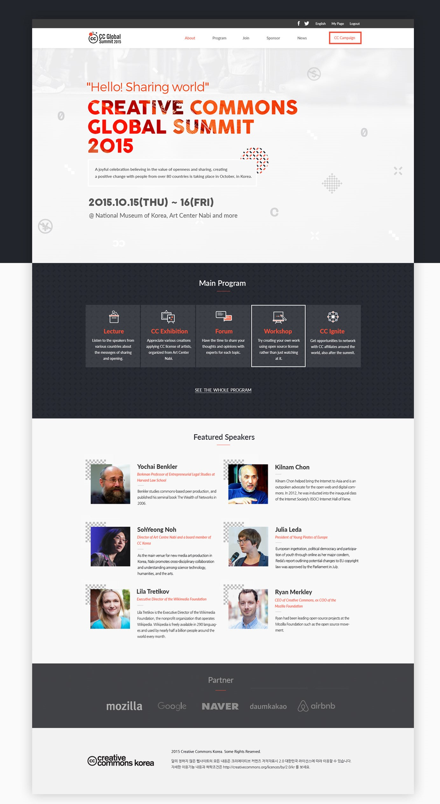

# LOUIS INC

> PROJECT DESCRIPTION .
This is  the capstone project of the html and css module of the mocroverse main curriculum, the project is based on an online website for BANTUFEST, inspired by the design created by [Cindy Shin](https://www.behance.net/gallery/29845175/CC-Global-Summit-2015)

Additional description about the project and its features.

## Built With

- HTML CSS
- Bootstrap 

## Live Demo

[Live Demo Link](https://raw.githack.com/alvinlouis29/LOUIS-INC/capstone/index.html)

## PROJECT DESCRIPTION

** This is my HTML/CSS capstone project from the microverse curriculum*

## Author

👤 **ALVIN LOUIS K**

- GitHub: [@githubhandle](https://github.com/alvinlouis29)
- Twitter: [@twitterhandle](https://twitter.com/louisssegawa)
- LinkedIn: [LinkedIn](https://www.linkedin.com/in/alvin-louis-632026183/)

## 🤝 Contributing

Contributions, issues, and feature requests are welcome!

Feel free to check the [issues page](issues/).

## Show your support

Give a ⭐️ if you like this project!
## 📝 License

This project is [MIT](lic.url) licensed.
